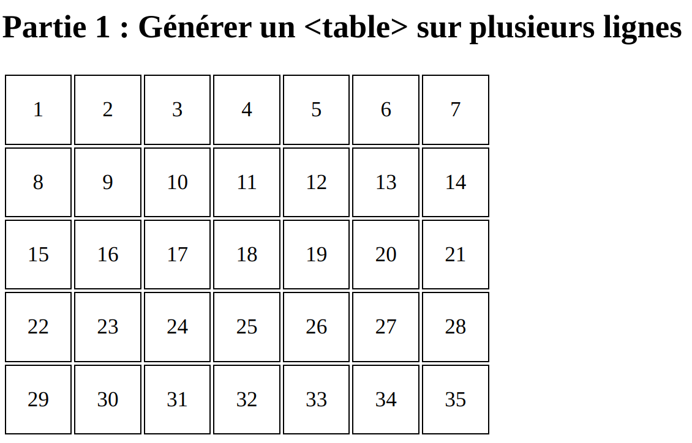
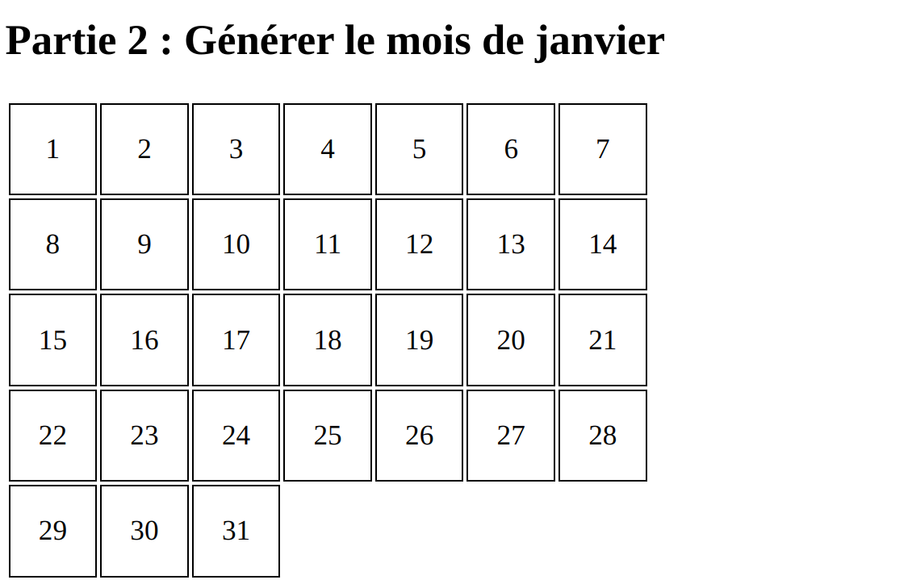
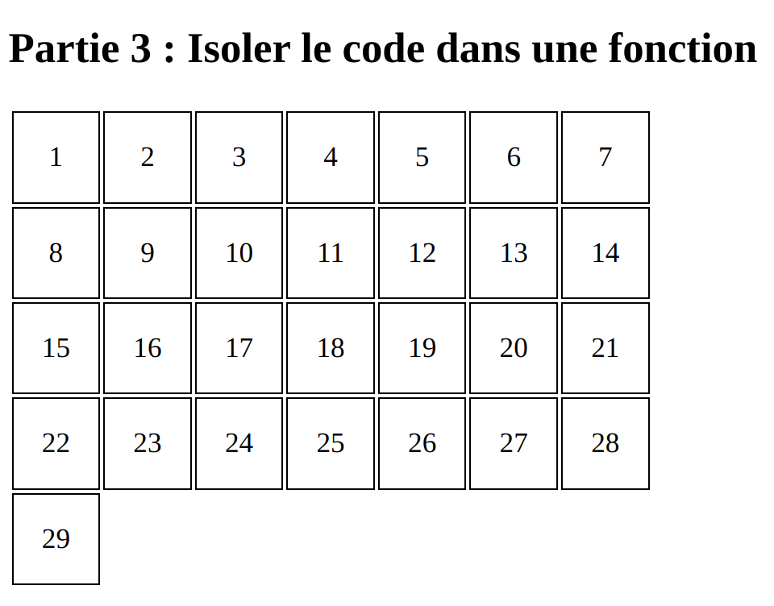
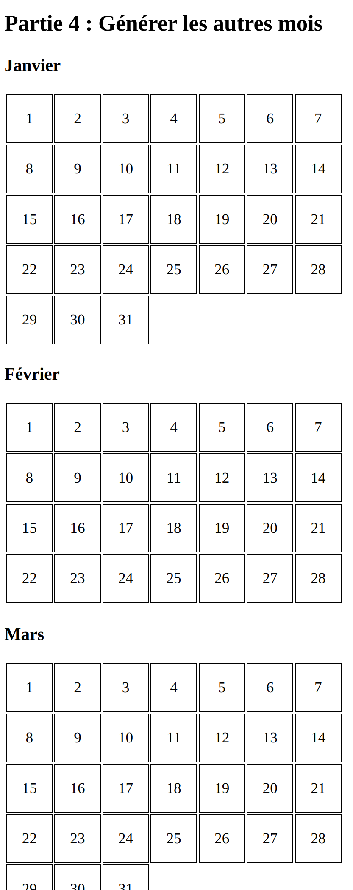
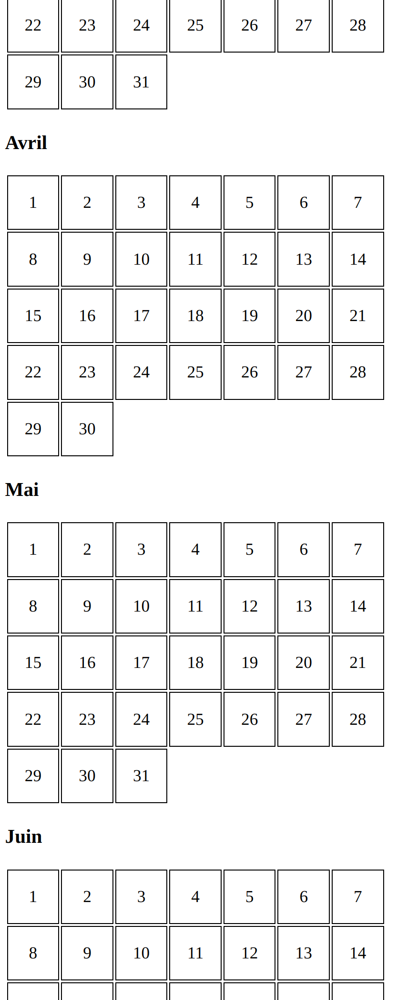
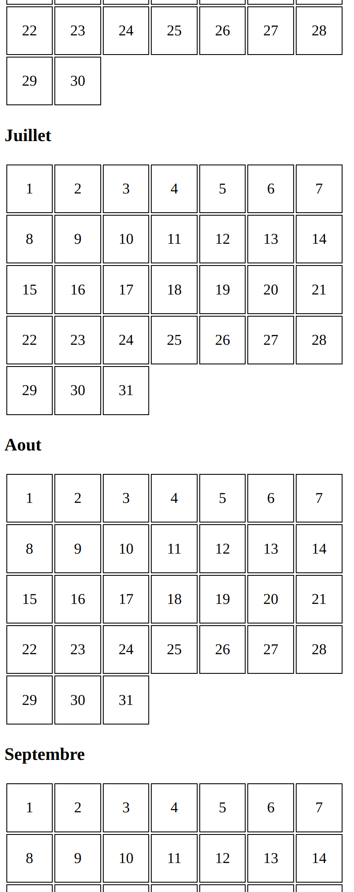
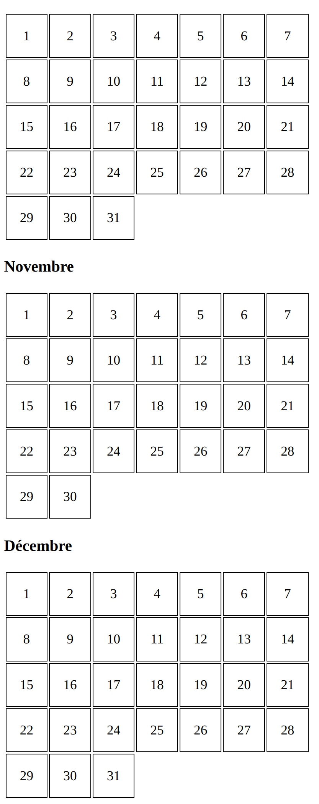
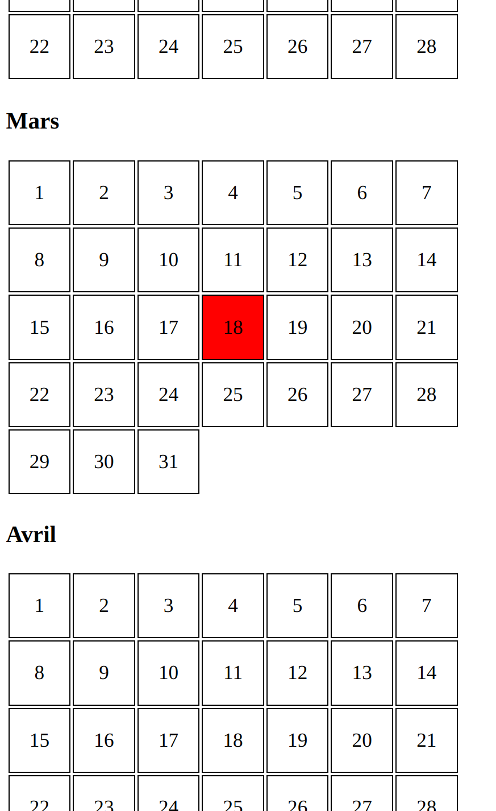

# JS-Calendar

## Table des matières
1. [Enoncé](#ennonce)  
2. [Partie 0 : Générer un `<table>` pour le mois de janvier](#partie-0--générer-un-table-pour-le-mois-de-janvier)  
3. [Partie 1 : Générer un `<table>` sur plusieurs lignes](#partie-1--générer-un-table-sur-plusieurs-lignes)  
4. [Partie 2 : Générer le mois de janvier](#partie-2--générer-le-mois-de-janvier)  
5. [Partie 3 : Isoler le code dans une fonction](#partie-3--isoler-le-code-dans-une-fonction)  
6. [Partie 4 : Générer les autres mois](#partie-4--générer-les-autres-mois)  
7. [Partie 5 : Afficher le jour courant en rouge](#partie-5--afficher-le-jour-courant-en-rouge)  
8. [Bonus : Matrix Code](#bonus--matrix-code)  
9. [Instructions de remise sur GitHub](#instructions-de-remise-sur-github)

---

## Enoncé
Nous allons construire un calendrier HTML (rudimentaire) à l'aide du langage JavaScript et de la fonction `document.write()`.

Le rendu final sera constituéd d'un fichier HTML nommé **JS-Calendar-NOM-PRENOM.html** (en majuscules, et les noms séparés par des `-`).

**Important** :  
- N'oubliez pas de commencer vos scripts en écrivant des **commentaires d’intention** puis le code correspondant.  

Avant la fin du cours, vous devrez mettre vos fichiers en ligne sur GitHub (voir [Instructions de remise sur GitHub](#instructions-de-remise-sur-github)).

---

## Partie 0 : Générer un `<table>` pour le mois de janvier

**Points :** 2/20

Écrire un programme qui va construire une table de **31 colonnes** permettant de représenter le mois de janvier.  
N'utiliser que **2 variables** : `max_days` et `current_day`.

À chaque tour de boucle, afficher dans la console le progrès :

```js
console.log('current/max : ' + current_day + '/' + max_days);
```

**Exemple de résultat** (représentation simplifiée) :


---

## Partie 1 : Générer un `<table>` sur plusieurs lignes

**Points :** 4/20

Écrire un programme qui va construire une table de **7 colonnes** et de **5 lignes**.

Utiliser **2 variables** nommées `max_col`, `max_line`.

**Exemple de résultat** (représentation simplifiée) :



---

## Partie 2 : Générer le mois de janvier

**Points :** 4/20

Écrire un programme qui va construire le **calendrier du mois de janvier**.  
Utiliser une variable nommée : `max_days_january`.




---

## Partie 3 : Isoler le code dans une fonction

**Points :** 2/20

Copier l’algorithme de la [Partie 2](#partie-2--générer-le-mois-de-janvier) dans une fonction :

```js
function print_table_month(max_days) {
  // code
}
```

Adapter le code pour tenir compte du paramètre `max_days` de la fonction.

Ensuite, appeler la fonction pour afficher le résultat pour 29 jours :

```js
print_table_month(29);
```


---

## Partie 4 : Générer les autres mois

**Points :** 4/20

Créer un tableau `month_max_days` contenant le **nombre de jours par mois** (janvier, février, mars, …, décembre).

Parcourir ce tableau pour générer les calendriers des autres mois en appelant la fonction `print_table_month` écrite précédemment.

Afficher le `<table>` de chaque mois **précédé** du nom du mois (ex. "Janvier", "Février", …) dans un `<h3>`.  
Les noms des mois sont stockés dans un tableau `month_names`.

*(On considère que l’année courante n’est pas bissextile.)*







---

## Partie 5 : Afficher le jour courant en rouge

**Points :** 4/20

Modifier votre programme pour qu’il affiche **aujourd’hui** en rouge.  
Pour obtenir le mois courant et le jour courant en JavaScript, on peut utiliser :

```js
let today = new Date();                
let current_month = today.getMonth();  // mois courant (0-11)
let current_day = today.getDate();     // jour courant (1-31)
```



---

## Bonus : Matrix Code

**Points supplémentaires :** +2

Modifier le fichier complet pour afficher le **code HTML généré** à la place du rendu HTML, si la variable `debug_mode` est à `true`.

Indice : vous pourriez placer le code généré dans un `<textarea>` au lieu d’écrire directement dans la page.

---

## Instructions de remise sur GitHub

1. **Créez un dépôt GitHub** (public ou privé, selon vos préférences).
2. Nommez votre dépôt par exemple `JS-Calendar-NOM-PRENOM`.
3. Dans ce dépôt, placez `JS-Calendar.html` (votre fichier HTML avec Javascript).
4. **Commitez** et **poussez** (push) vos modifications sur GitHub.
5. **Partagez** ensuite l’URL de votre dépôt sur la plateforme Teams dans le canal LPB

---

**Bon travail et bonne création de calendrier en JavaScript !**