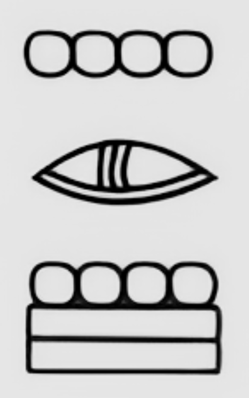
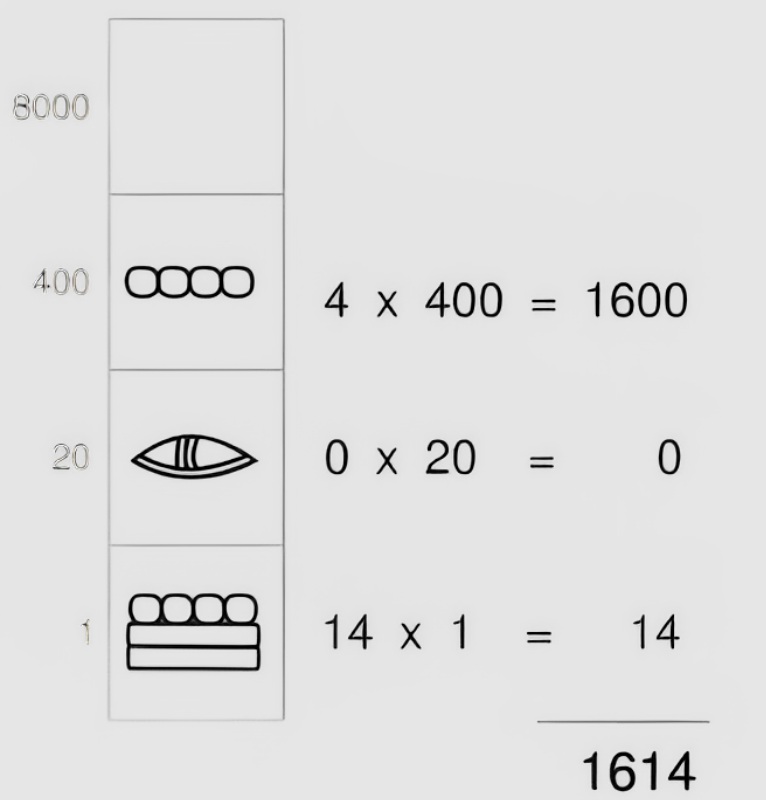

# ALGO-101 - Cours d'algorithmique

## Chapitre 2: Les systèmes de numération

> Si le dessin d'une pipe n'est pas une pipe, alors le dessin d'un nombre n'est pas sa réalité tangible. Ces dessins, ou symboles, ne peuvent représenter des quantités que si leur lecture repose sur un ensemble de conventions : les systèmes de numération

### Représentation des nombres

| Pomme                         | Décimal | Binaire |
| ----------------------------- | ------- | ------- |
| 🍎                            | 1       | 1       |
| 🍎🍎                          | 2       | 10      |
| 🍎🍎🍎🍎🍎🍎🍎 🍎🍎🍎🍎🍎🍎🍎 | 14      | 1110    |

1, 2 & 32 sont des symboles, des représentations de valeurs réelles, tangibles. Quid du 0 ? Que représente-t-il ?

Un indice, l'image ci-dessous représente le nombre 1614 en chiffres maya.



---

### La représentation décimale par/pour les humains

#### Système de numération positionnel en base 10

Symboles: `01245689`

```
  0 -   9
 10 -  19
 20 -  29
 30 -  39
   ...
 90 -  99
100 - 199
200 - 299
   ...
900 - 999
```

Avec les zéros **non-significatifs**, on peut écrire des nombres de 0 à 999 de cette manière:

```
000 - 009
010 - 019
020 - 029
030 - 039
   ...
090 - 099
100 - 999
200 - 299
   ...
300 - 999
```

#### Décomposition d'un nombre décimal

Décomposons

```
847 = 800 + 40 + 7
```

Reformulons

```
847 = 8 x 100 + 4 x 10 + 7 x 1
```

On s'accroche

```
847 = 8 x 10² + 4 x 10¹ + 7 x 10⁰
```

Ou, sous forme de tableau:

| Centaines | Dizaines | Unités |
| --------- | -------- | ------ |
| 800       | 40       | 7      |

| **×100** | **×10**  | **×1**   |
| -------- | -------- | -------- |
| **×10²** | **×10¹** | **×10⁰** |
| 8        | 4        | 7        |
| **²**    | **¹**    | **⁰**    |

La **base est 10** et la **puissance** est le rang (0,1,2,..)

---

### Sexagésimal (base 60)

```
0 → 9
10 → 19
20 → 59
100 → 159
200 → 259
5900 → 5959
10000 → 15900
```

<details>
  <summary><strong>Voir le secret</strong></summary>

```
00:00:00 → 00:00:09
00:00:10 → 00:00:19
00:00:20 → 00:00:59
00:01:00 → 00:01:59
00:02:00 → 00:02:59
00:59:00 → 00:59:59
01:00:00 → 01:00:59
```

Pourquoi?

- 60 minutes, 60 secondes
- 360 degrés
- une demi-douzaine d'oeufs

</details>

### Vigésimal (base 20)

Le dernier système est un vestige linguistique

Comptons les dizaines jusqu'à 100: 10, 20, 30, 40, 50, 60 et puis les problèmes commencent:

En France, on dit:

```
70 (soixante-dix)
80 (quatre-vingts)
90 (quatre-vingt-dix)
```

En Belgique, on dit:

```
70 (septante)
80 (quatre-vingts)
90 (nonante)
```

En Suisse, on dit:

```
70 (septante)
80 (huitante)
90 (nonante)
```

Ces différences dans les noms des dizaines entre la France, la Belgique et la Suisse s'expliquent par l'évolution historique des systèmes de numération.

Le système français utilise un mélange de bases 10 et 20, cette façon de compter vient d'influences celtes et vikings, où le système vicésimal (base 20) était courant. Cette trace se retrouve d'ailleurs dans l'anglais ancien "score".

Les systèmes belge et suisse utilisent une logique décimale plus cohérente:

- "Septante" vient directement du latin "septuaginta" (70)
- "Huitante/octante" dérive du latin "octoginta" (80)
- "Nonante" provient du latin "nonaginta" (90)

---

### Binaire (base 2)

L'ordinateur ne connaît qu'un système: le binaire (0 et 1)

Quand il n'y a plus que les chiffres 0 et 1 pour compter, l'importance du chiffre 0 apparaît évidente, mais toujours obscure. 0 veut dire « rien » après tout, et pourtant on fait presque tout avec 0 et 1.

#### Le rôle du zéro

Si 0 c'est rien, c'est rien de quoi?

Décomposons le nombre décimal 1023:

```
1023 = 1 x 1000 + 0 x 100 + 2 x 10 + 3 x 1
```

Le 0 tient la position du rang des 100 et annule le résultat de la multiplication du rang 100.

### Notation positionnelle

Dans la notation positionnelle, chaque position d'un chiffre/symbole est reliée à la position voisine par un multiplicateur appelé base du système de numération:

```
Base 10: 1023
         10³  10²  10¹  10⁰
         1    0    2    3
```

Pas de questions ?
Passons à la base 2, que vaut `1101` ?

```
Base 2:  1101
         2³   2²   2¹   2⁰
         1    1    0    1
```

---


