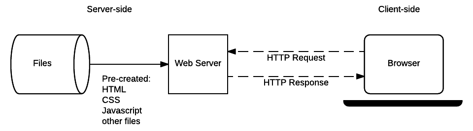
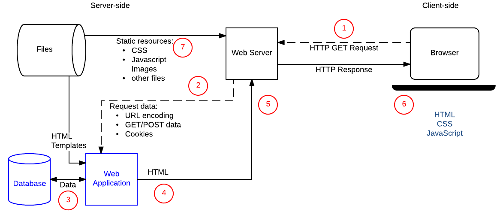

# Session 11 - PHP-101

## Plan du chapitre
1. Comprendre ce qu’est PHP
2. Distinguer site statique et site dynamique
3. Comprendre les environnements de travail
4. Découvrir la syntaxe de base de PHP
5. Introduire les tableaux associatifs

---

# 1. Introduction à PHP

## 1.1. Qu’est-ce que PHP ?

PHP signifie **PHP: Hypertext Preprocessor**.

C’est un langage de programmation principalement utilisé pour le web.  
Il a été créé en **1994** par **Rasmus Lerdorf**.

PHP est exécuté sur le serveur, puis génère du HTML envoyé au navigateur.

Autrement dit :

- le navigateur lit du **HTML**
- le serveur exécute du **PHP**
- PHP sert souvent à **fabriquer le HTML dynamiquement**

---

## 1.2. Pourquoi apprendre PHP ?

PHP est un langage important dans l’histoire du web et reste encore aujourd’hui très utilisé.

Il présente plusieurs avantages :

- il est relativement simple à aborder pour débuter
- il permet aussi de construire des projets plus complexes
- il est **open source**
- il est gratuit
- il fonctionne sur de très nombreuses configurations
- il s’intègre très bien avec les bases de données, notamment **MySQL**

De nombreux sites et outils célèbres ont été construits avec PHP, comme par exemple **Facebook** à ses débuts ou **Wikipédia**.

---

## 1.3. À quoi sert PHP concrètement ?

PHP permet de produire des pages qui changent selon le contexte.

Par exemple, on peut afficher un contenu différent selon :

- l’heure de la journée
- l’utilisateur connecté
- les données d’un formulaire
- une recherche effectuée sur le site
- les contenus enregistrés dans une base de données

PHP est donc un langage utile pour créer des **sites dynamiques** et des **applications web**.

---

# 2. Sites statiques et sites dynamiques

## 2.1. Site statique

Un site statique est un site dont les pages restent identiques pour tous les visiteurs.

Le contenu ne change pas automatiquement selon :

- la personne qui visite
- l’heure
- des données enregistrées
- des interactions particulières

Exemples :

- un CV en ligne
- une page de présentation
- un microsite d’annonce
- une landing page très simple

Un site réalisé uniquement en **HTML / CSS / JavaScript**, sans traitement côté serveur, est en principe statique.


---

## 2.2. Site dynamique

Un site dynamique peut produire un contenu différent selon la situation.

Il peut :

- afficher un prénom si l’utilisateur est connecté
- montrer des articles différents selon une catégorie
- gérer des comptes utilisateurs
- traiter des formulaires
- communiquer avec une base de données

Le contenu de la page n’est donc plus entièrement figé.

PHP fait partie des langages qui permettent de produire ce type de site.  
Dans ce cours, nous nous concentrerons sur le couple :

**PHP / MySQL**



---

## 2.3. Pourquoi cette distinction est-elle importante ?

Avant d’écrire du code, il faut comprendre **ce que l’on essaie de construire**.

Si un site doit simplement présenter des informations fixes, un site statique peut suffire.

Si le site doit :

- réagir à l’utilisateur
- stocker des données
- adapter l’affichage
- automatiser certaines tâches

alors on entre dans le domaine du **dynamique**.

---

# 3. Les environnements : dev, staging, prod

## 3.1. Pourquoi parle-t-on d’environnements ?

Quand on développe un site, on ne travaille pas directement sur le site visible par tout le monde.

On distingue généralement plusieurs environnements de travail.

Cette séparation permet de :

- développer sans danger
- tester avant publication
- éviter de casser le site en ligne

---

## 3.2. L’environnement de développement

L’environnement de développement, ou **dev**, est l’environnement dans lequel le développeur travaille.

En général, il est installé sur sa propre machine.

On parle alors de travail **en local**.

En local :

- nous avons accès à tous les fichiers
- nous pouvons faire des erreurs sans conséquence publique
- nous pouvons tester librement

C’est l’endroit où l’on construit, modifie et expérimente.

---

## 3.3. L’environnement de production

La **production** est la version du site accessible aux vrais visiteurs.

C’est le site “en ligne”, celui qui est réellement utilisé.

En production :

- les visiteurs voient les modifications
- les erreurs ont un impact immédiat
- chaque changement doit être maîtrisé

On ne développe donc pas en production.

Formule importante :

**On ne développe pas en production, on passe en production.**

---

## 3.4. L’environnement de staging

Le **staging**, ou **pré-production**, est une étape intermédiaire.

C’est une copie du site, hébergée sur un serveur, mais dont l’accès est généralement limité aux développeurs ou aux testeurs.

Le staging sert à :

- vérifier que tout fonctionne dans des conditions proches du réel
- tester avant mise en ligne
- repérer les bugs avant qu’ils n’atteignent les visiteurs

Le schéma classique est donc :

**développement local → staging → production**

---

## 3.5. L’environnement nécessaire pour PHP

PHP est un langage interprété côté serveur.  
Pour travailler en local, il faut donc installer un environnement contenant au minimum :

- un serveur web
- l’interpréteur PHP
- un système de gestion de base de données, comme MySQL

Selon le système d’exploitation, on utilise souvent :

- **WAMP** sur Windows
- **MAMP** sur Mac
- **XAMPP** sur Linux

L’environnement local ne sera jamais exactement identique à la production, mais il doit s’en rapprocher suffisamment pour permettre un développement fiable.

---

# 4. Premiers pas en syntaxe PHP

## 4.1. Avant de commencer : que va-t-on apprendre ?

Comme dans d’autres langages, on va manipuler quelques grandes familles d’actions :

- **stocker** des données
- **transformer** des données
- **tester** des conditions
- **répéter** des instructions

Dans ce premier chapitre, on commence par la base :  
**écrire du PHP dans une page HTML**.

---

## 4.2. Insérer du PHP dans une page HTML

PHP s’écrit entre les balises suivantes :

```php
<?php
    // code PHP
?>
````

Exemple :

```php
<!DOCTYPE html>
<html>
<head>
    <meta charset="utf-8">
    <title>Premier script PHP</title>
</head>
<body>

    <h1>Titre principal</h1>

    <?php
        echo 'When the world becomes standard<br>';
    ?>

    <p>Un paragraphe</p>

</body>
</html>
```

---

## 4.3. La commande `echo`

La commande `echo` permet d’afficher du texte.

Exemple :

```php
<?php
echo 'Bonjour';
?>
```

Ici, PHP affiche le mot `Bonjour`.

Dans une page web, ce texte est envoyé dans le HTML final.

---

## 4.4. Les commentaires

Les commentaires servent à expliquer le code ou à désactiver temporairement une partie de celui-ci.

### Commentaire sur une ligne

```php
// ceci est un commentaire
```

### Commentaire sur plusieurs lignes

```php
/*
ceci est
un commentaire
sur plusieurs lignes
*/
```

Exemple :

```php
<?php

// Afficher la première ligne de la citation
echo 'When the world becomes standard<br>';

/*
La ligne suivante est commentée,
elle ne sera donc pas exécutée.

echo "I will start caring about standards";
*/

?>
```

---

## 4.5. Les variables

Une variable sert à stocker une valeur.

En PHP, une variable commence toujours par le symbole `$`.

Exemple :

```php
<?php
$nom = 'Lyna';
?>
```

Ici :

* `$nom` est le nom de la variable
* `'Lyna'` est la valeur stockée

---

## 4.6. Afficher une variable

On peut combiner texte fixe et variable avec `echo`.

```php
<?php
$nom = 'Lyna';

echo 'Je m\'appelle ' . $nom . '.';
?>
```

Le point `.` sert à **concaténer**, c’est-à-dire à coller plusieurs morceaux de texte.

---

## 4.7. Guillemets simples, doubles, et caractères d’échappement

En PHP, on peut écrire des chaînes de caractères avec :

* des guillemets simples : `'...'`
* des guillemets doubles : `"..."`

Quand un caractère gêne l’écriture de la chaîne, on utilise un caractère d’échappement `\`.

Exemple :

```php
<?php
$nom = 'Lyna';

echo 'Je m\'appelle ' . $nom . ' mais on m\'appelle "Boutouyou"<br>';
echo "Je m'appelle $nom mais on m'appelle \"Boutouyou\"<br>";
?>
```

Remarques :

* dans `'...'`, l’apostrophe doit être échappée : `\'`
* dans `"..."`, les guillemets internes peuvent être échappés : `\"`

---

## 4.8. Exemple complet

```php
<!DOCTYPE html>
<html>
<head>
    <meta charset="utf-8">
    <title>Variables</title>
</head>
<body>

    <h1>Variables et caractères d'échappement</h1>

    <?php

    $nom = 'Lyna';

    echo 'Je m\'appelle ' . $nom . ' mais on m\'appelle "Boutouyou"<br>';
    echo "Je m'appelle $nom mais on m'appelle \"Boutouyou\"<br>";

    ?>

</body>
</html>
```

---

# 5. Les tableaux associatifs

## 5.1. Pourquoi introduire les tableaux ?

Jusqu’ici, nous avons stocké une seule valeur dans une variable.

Mais dans un vrai programme, on doit souvent stocker :

* plusieurs valeurs
* des groupes d’informations
* des données liées entre elles

C’est le rôle des **tableaux**.

---

## 5.2. Tableau indexé

Un tableau indexé stocke plusieurs valeurs accessibles par leur position.

Exemple :

```php
<?php
$colors = ['red', 'green', 'blue'];

echo $colors[1]; // affiche green
?>
```

Ici :

* `red` est à l’index `0`
* `green` est à l’index `1`
* `blue` est à l’index `2`

---

## 5.3. Tableau vide

On peut créer un tableau vide, puis le remplir plus tard.

```php
<?php
$users = [];
?>
```

---

## 5.4. Tableau associatif : principe

Un tableau associatif fonctionne avec des **clefs textuelles**.

Au lieu d’accéder à une donnée avec un numéro, on y accède avec un mot.

C’est utile quand on veut donner du sens aux données.

Exemple :

```php
<?php
$lyna = [
    'name'  => 'Lyna',
    'age'   => 4,
    'email' => 'lyna@amstram.be'
];

echo $lyna['name'];
?>
```

Ici :

* `'name'`, `'age'`, `'email'` sont des clefs
* chaque clef est liée à une valeur

---

## 5.5. Pourquoi les tableaux associatifs sont-ils utiles ?

Ils permettent d’écrire un code plus clair.

Comparez :

```php
$personne[0]
$personne[1]
$personne[2]
```

avec :

```php
$personne['name']
$personne['age']
$personne['email']
```

Dans le second cas, on comprend immédiatement ce que représente chaque donnée.

---

## 5.6. Exemple simple : emails de personnes

```php
<?php
$mails = [];

$mails['Lyna'] = 'lyna@amstram.be';
$mails['Amandine'] = 'amandine@mozilla.org';

echo $mails['Lyna'];
?>
```

Ici, les noms servent de clefs.

---

## 5.7. Exemple plus structuré : une personne

```php
<?php
$mathilde = [
    'name'  => 'Mathilde',
    'age'   => 27,
    'email' => 'math@gmail.com'
];

echo $mathilde['age']; // affiche 27
?>
```

---

## 5.8. Tableau associatif contenant plusieurs personnes

```php
<?php
$personnes = [];

$personnes['Mathilde'] = [
    'age'   => 27,
    'email' => 'math@gmail.com'
];

$personnes['Lyna'] = [
    'age'   => 4,
    'email' => 'lyna@amstram.be'
];

echo $personnes['Mathilde']['age'];   // affiche 27
echo $personnes['Lyna']['email'];     // affiche lyna@amstram.be
?>
```

Cet exemple est plus cohérent pédagogiquement que la version brute OCR, car il montre clairement :

1. un tableau principal
2. des clefs de premier niveau (`Mathilde`, `Lyna`)
3. des sous-tableaux contenant plusieurs informations

---

# 6. Ce qu’il faut retenir

À ce stade, il faut retenir les idées suivantes :

* PHP est un langage serveur utilisé pour produire des pages web dynamiques
* un site statique n’adapte pas son contenu, un site dynamique oui
* on distingue les environnements **dev**, **staging** et **prod**
* le code PHP s’écrit entre `<?php` et `?>`
* `echo` permet d’afficher du contenu
* une variable commence par `$`
* un tableau peut être indexé ou associatif
* un tableau associatif permet de nommer clairement les données

---

# 7. Progression logique pour la suite

Après ce chapitre, la suite pédagogique naturelle serait :

1. variables et types de données
2. conditions (`if`, `else`)
3. opérateurs de comparaison
4. boucles
5. formulaires
6. fonctions
7. inclusion de fichiers
8. superglobales (`$_GET`, `$_POST`, etc.)
9. connexion à une base de données

---

# 8. Exemples récapitulatifs

## Exemple 1 : afficher une variable

```php
<?php
$prenom = 'Lyna';
echo 'Bonjour ' . $prenom;
?>
```

## Exemple 2 : tableau indexé

```php
<?php
$colors = ['red', 'green', 'blue'];
echo $colors[2];
?>
```

## Exemple 3 : tableau associatif

```php
<?php
$user = [
    'name' => 'Lyna',
    'age' => 4
];

echo $user['name'];
?>
```

## Exemple 4 : structure plus complète

```php
<?php
$users = [
    'Lyna' => [
        'age' => 4,
        'email' => 'lyna@amstram.be'
    ],
    'Mathilde' => [
        'age' => 27,
        'email' => 'math@gmail.com'
    ]
];

echo $users['Mathilde']['email'];
?>
```

```

Je peux aussi en faire une **version “support de cours enseignant”**, avec :
- objectifs pédagogiques par section,
- pièges fréquents,
- mini-exercices après chaque notion,
- et une progression encore plus adaptée à un premier atelier.
```
